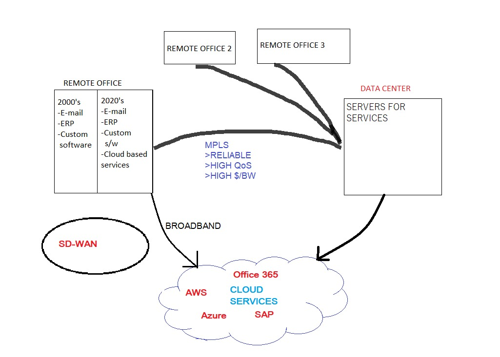

# SD-WAN
* Sowtware Defined Wide Area Network 
* THESIS DEMO - PROOF OF CONCEPT (simulated using gns3)
* Done as a part of the coursework, Computer Networks and Protocols (18EC62)
* Here is a block diagram of the implementation

